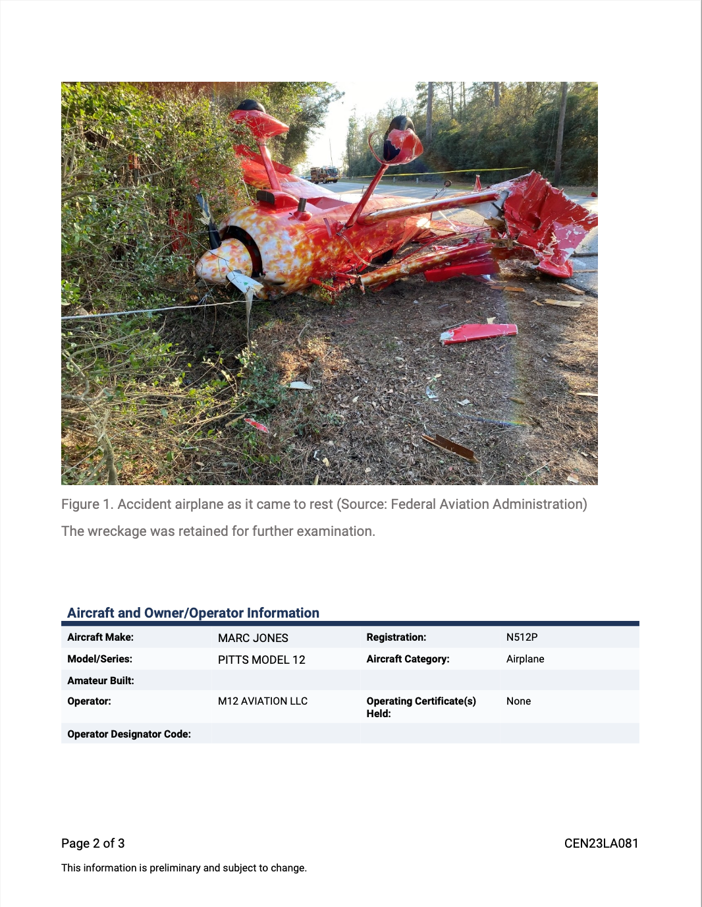

## Introduction

In [this example](https://colab.research.google.com/drive/120STOQ5wGIpFUbgS7Gcld_PVW-CfLWOg#scrollTo=bTu2a1K-F19w), we'll use DocParse to extract data from an NTSB report. We'll go through the important code snippets below to see what's going on. For the purposes of this tutorial, we focus on page 2 of the document, given below.

<Frame>
  
</Frame>

## Getting Parsed Document

### Making a Call to DocParse

```python text_demo.py
with open(file_name, 'rb') as file:
  ## Make a call to the partitioning service and set extract_images to true.
  partitioned_file = partition_file(file, aryn_api_key, extract_images=True, extract_table_structure=True, use_ocr=False, selected_pages=[2])
```
We can call the `partition_file` function from the `aryn_sdk.partition` module to extract the text and images from the document. The `aryn_api_key` is the API key that you get from the Aryn platform. The `extract_images` parameter is set to `True` to extract images from the document. The `extract_table_structure` parameter is set to `True` to extract tables from the document. The `use_ocr` parameter is set to `False` to extract text using an OCR model instead of extracting embedded text in the PDF. The `selected_pages` parameter is set to `[2]` to extract information from page 2 of the document.

### Viewing the JSON Output

```json output.json
{'status': ['Incremental status will be shown here during execution.',
  "Until you get a line that matches '  ]\n', you can convert the partial",
  'output to a json document by appending \'""]}\' to the partial output.',
  '',
  'T+   0.00: Server version managed-service-22-model-1-4 Model version 1.4',
  'T+   0.00: Received request with aryn_call_id=REDACTED',
  'T+   0.00: Waiting for scheduling',
  'T+   0.01: Preprocessing document',
  'T+   0.01: Done preprocessing document',
  'T+   0.51: Completed work on page 2',
  ''],
 'elements': [{'type': 'Image',
   'bbox': [0.0873676793715533,
    0.08911955399946733,
    0.8548237161075367,
    0.5357984508167614],
   'properties': {'score': 0.873895525932312,
    'image_size': [1324, 1003],
    'image_mode': 'RGB',
    'image_format': None,
    '_element_index': 1,
    'page_number': 2},
   'binary_representation': ...
 }
```

Above, you can see the JSON output from the call to Aryn DocParse. The output is a JSON object with a `status` field that shows the status of the call and an `elements` field that contains a list of elements extracted from the document. Each element has a `type`, `bbox`, `properties`, and `text_representation` field. The `type` field indicates the type of the element (e.g. text, image, table, etc.), the `bbox` field contains the coordinates of the bounding box around the element, the `properties` field contains additional information about the element (e.g. confidence score, page number, etc.), and the `text_representation` field contains the text content of the element. The call ID has been redacted for privacy reasons.

## Examining Individual Elements

### Extracting an Image from the Document

```json image.json

{ 
  type': 'Image',
 'bbox': [0.0873676793715533,
  0.08911955399946733,
  0.8548237161075367,
  0.5357984508167614],
 'properties': {'score': 0.873895525932312,
  'image_size': [1324, 1003],
  'image_mode': 'RGB',
  'image_format': None,
  '_element_index': 1,
  'page_number': 2},
 'binary_representation': ...
}
```
The first element we see is an image. We get back a bounding box and a binary representation of the image, which we can use to display the image.

### Extracting Captions from the Document

```json caption.json

{'type': 'Caption',
 'bbox': [0.08805406458237591,
  0.5466218150745739,
  0.8386106244255515,
  0.5634380548650568],
 'properties': {'score': 0.6033732891082764,
  '_element_index': 3,
  'page_number': 2},
 'text_representation': 'Figure 1. Accident airplane as it came to rest (Source: Federal Aviation Administration)\n'}
```
The second element we see is a caption. We get back a bounding box and the text content of the caption.

### Extracting Text from the Document

```json text.json
{'type': 'Text',
 'bbox': [0.08857761158662684,
  0.5770943936434659,
  0.5373964197495404,
  0.5928012917258523],
 'properties': {'score': 0.589328944683075,
  '_element_index': 5,
  'page_number': 2},
 'text_representation': 'The wreckage was retained for further examination. \n'}
```
The third element we see is a text element. We get back a bounding box and the text content of the element.

### Extracting a Table from the Document

```json table.json

{ 
 'type': 'table',
 'bbox': [0.09319061279296875,
  0.6873569003018466,
  0.9122876694623162,
  0.8174545010653409],
 'properties': {'score': 0.8106631636619568,
  'title': None,
  'columns': None,
  'rows': None,
  '_element_index': 2,
  'page_number': 2},
 'text_representation': None,
 'table': {'cells': [{'content': 'Aircraft Make:',
    'rows': [0],
    'cols': [0],
    'is_header': True,
    'bbox': {'x1': 0.09705882369281045,
     'y1': 0.6968232236868688,
     'x2': 0.27310294133986934,
     'y2': 0.7097020113257576},
    'properties': {}},
   {'content': 'MARC JONES',
    'rows': [0],
    'cols': [1],
    'is_header': True,
    'bbox': {'x1': 0.31151960800653594,
     'y1': 0.6968232236868688,
     'x2': 0.43984150343137257,
     'y2': 0.7097020113257576},
    'properties': {}},...
}
```
The fourth  element we see is an table. We get back a bounding box and the table structure, which includes the cells of the table and their properties.

#### Displaying the Table

Here we display the table in clean markdown format below. We clean the column headers to make them a separate row in the table.
```python display_table.py
import pandas as pd
pandas = tables_to_pandas(partitioned_file)
# Let's display the pandas dataframe
table = pandas[4][1]
table = pd.concat([pd.DataFrame([table.columns], columns=table.columns), table], ignore_index=True)

table.columns = ['' for col in table.columns] # Optionally reset the column headers

table
```
The output is given below:

|    |                           |                  |                           |          |
|---:|:--------------------------|:-----------------|:--------------------------|:---------|
|  0 | Aircraft Make:            | MARC JONES       | Registration:             | N512P    |
|  1 | Model/Series:             | PITTS MODEL 12   | Aircraft Category:        | Airplane |
|  2 | Amateur Built:            |                  |                           |          |
|  3 | Operator:                 | M12 AVIATION LLC | Operating Certificate(s)  | None     |
|    |                           |                  | Held:                     |          |
|  4 | Operator Designator Code: |                  |                           |          |

