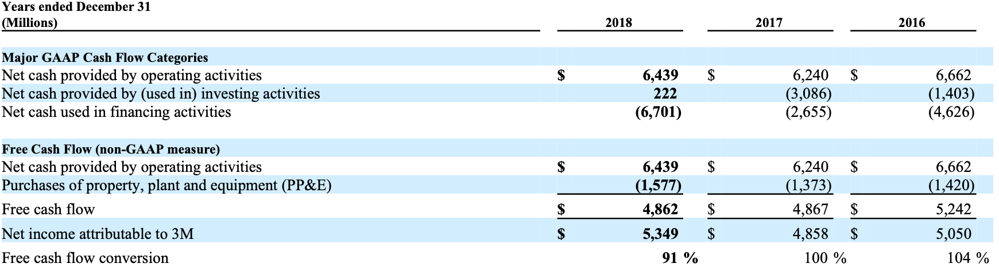

In [this example](https://colab.research.google.com/drive/1Qpd-llPC-EPzuTwLfnguMnrQk0eclyqJ?usp=sharing), we'll use DocParse to extract a cash flow table (shown below) from the 10k financial document  of 3M, and turn it into a pandas dataframe. 

<Frame>
  
</Frame>

## Extracting Table Cell from DocParse

```python table_demo.py
import aryn_sdk
from aryn_sdk.partition import partition_file, tables_to_pandas
import pandas as pd
from io import BytesIO

file = open('my-document.pdf', 'rb')
aryn_api_key = 'YOUR-KEY-HERE'

## Make a call to Aryn DocParse
## param extract_table_structure (boolean): extract tables and their structural content. default: False
## param use_ocr (boolean): extract text using an OCR model instead of extracting embedded text in PDF. default: False
## returns: JSON object with elements representing information inside the PDF
partitioned_file = partition_file(file, aryn_api_key, extract_table_structure=True, use_ocr=True)
```

If you inspect the partitioned_file variable, you'll notice that it's a large JSON object with details about all the components in the PDF (checkout [this page](./output_structure) to understand the schema of the returned JSON object in detail).  Below, we highlight the `table` element that contains the information about the table in the page.


```json output.json
{'type': 'table',
   'bbox': [0.09049919577205882,
    0.35081939697265624,
    0.8906761259191176,
    0.5200832852450284],
   'properties': {'score': 0.9009878635406494,
    'title': None,
    'columns': None,
    'rows': None,
    '_element_index': 7,
    'page_number': 1},
   'text_representation': None,
   'table': {'cells': [{'content': 'Years ended December 31 (Millions)',
      'rows': [0],
      'cols': [0],
      'is_header': True,
      'bbox': {'x1': 0.09167566636029412,
       'y1': 0.3512739424272017,
       'x2': 0.355205078125,
       'y2': 0.37081939697265626},
      'properties': {}},
     {'content': '2018',
      'rows': [0],
      'cols': [1],
      'is_header': True,
      'bbox': {'x1': 0.5346168428308824,
       'y1': 0.3512739424272017,
       'x2': 0.6546168428308824,
       'y2': 0.37081939697265626},
      'properties': {}},
    ... ]}}
```

In particular let's look at the `cells` field  which is an array of cell objects that represent each of the cells in the table. Let's focus on the first element of that list. 

```json cells.json
{'cells': [{'content': 'Years ended December 31 (Millions)',
      'rows': [0],
      'cols': [0],
      'is_header': True,
      'bbox': {'x1': 0.09167566636029412,
       'y1': 0.3512739424272017,
       'x2': 0.355205078125,
       'y2': 0.37081939697265626},
      'properties': {}}, ... }

```

## Displaying the Table

Here we've detected the first cell, its bounding box (which indicates the coordinates of the cell in the PDF), whether it's a header cell and its contents. You can then process this JSON however you'd like for further analysis. In [the notebook](https://colab.research.google.com/drive/1Qpd-llPC-EPzuTwLfnguMnrQk0eclyqJ?usp=sharing)  we use the `tables_to_pandas` function to turn the JSON into a pandas dataframe and then perform some analysis on it:

```python display_table.py
pandas = tables_to_pandas(partitioned_file)

tables = []
#pull out the tables from the list of elements
for elt, dataframe in pandas:
    if elt['type'] == 'table':
        tables.append(dataframe)
        
supplemental_income = tables[0]
display(supplemental_income)
```
The output is given below:

|    | Years ended December 31 (Millions)                  | 2018    | 2017    | 2016    |
|---:|:----------------------------------------------------|:--------|:--------|:--------|
|  0 | Major GAAP Cash Flow Categories                     |         |         |         |
|  1 | Net cash provided by operating activities           | $ 6,439 | 6,240   | $ 6,662 |
|  2 | Net cash provided by (used in) investing activities | 222     | (3,086) | (1,403) |
|  3 | Net cash used in financing activities.              | (6,701) | (2,655) | (4,626) |
|  4 | Free Cash Flow (non-GAAP measure)                   |         |         |         |
|  5 | Net cash provided by operating activities           | $ 6,439 | $ 6,240 | 6,662   |
|  6 | Purchases of property, plant and equipment (PP&E    | (1,577) | (1,373) | (1,420) |
|  7 | Free cash flow                                      | $ 4,862 | $ 4,867 | $ 5,242 |
|  8 | Net income attributable to 3M                       | $ 5,349 | $ 4,858 | $ 5,050 |
|  9 | Free cash flow conversion                           | 91 %    | 100 %   | 104 %   |

